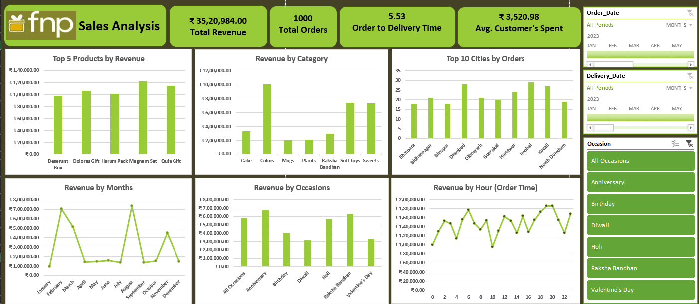

# FNP-Sales-Analysis-Dashboard
Sales Analysis Dashboard built using Microsoft Excel.
## Project Overview

This project analyzes Ferns & Petals (FNP) sales data to uncover insights related to revenue trends, customer behavior, product performance, and delivery efficiency.

The dashboard was built using Microsoft Excel with Pivot Tables, Pivot Charts, Power Query, KPI Cards, and Interactive Slicers.
## Dashboard Preview

## Key Performance Indicators

| Metric | Value |
|----------|---------|
| Total Revenue | ₹35,20,984 |
| Total Orders | 1,000 |
| Average Delivery Time | 5.53 Days |
| Average Customer Spend | ₹3,520.98 |

## Business Insights

### Monthly Revenue Analysis
- August generated the highest revenue.
- February recorded the second-highest revenue due to Valentine's Day demand.

### Top Products Analysis
- Magnam Set is the highest revenue-generating product.
- Premium gift bundles contribute significantly to sales.

### Revenue by Category
- Colors category generated the highest revenue.
- Soft Toys and Sweets followed closely.

### Revenue by Occasion
- Anniversary and Raksha Bandhan generated the highest sales.

### Top Cities Analysis
- Imphal, Dhanbad, and Kavali recorded the highest order volumes.

### Revenue by Hour
- Sales peak during evening hours between 6 PM and 8 PM.

### Delivery Performance
- Average delivery time is 5.53 days.

## Recommendations

- Focus marketing campaigns on Anniversary and Raksha Bandhan.
- Promote top-selling products during festive seasons.
- Improve delivery efficiency to reduce average delivery time.
- Run targeted campaigns in high-performing cities.

## Tools Used

- Microsoft Excel
- Pivot Tables
- Pivot Charts
- Power Query
- Data Cleaning
- Dashboard Design
- Data Visualization

## Conclusion

The analysis reveals that occasion-driven purchasing behavior is the primary revenue driver for FNP. Anniversary and Raksha Bandhan contribute the highest revenue, while Magnam Set is the top-performing product. The dashboard provides actionable insights to support data-driven decision-making and business growth.
